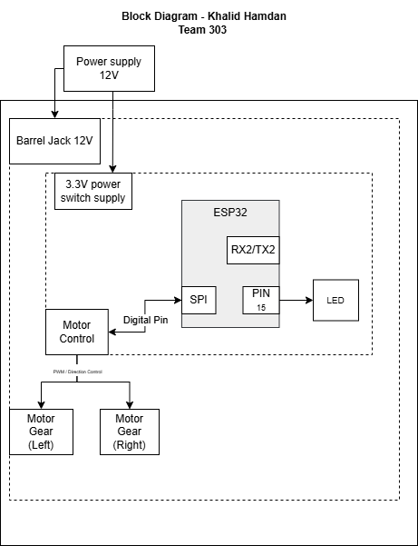

## Overview
The locomotion control system is powered by a 12 V supply, which feeds the motor driver and is stepped down to 3.3 V to power the ESP32 microcontroller and onboard sensors. The ESP32 receives wheel speed feedback from a Hall effect sensor and processes these data to regulate motor output. Control signals for the left and right gear motors are sent from the motor driver, which is commanded by the ESP32 via SPI following sensor data processing. The ESP32 also handles remote motor commands received over UART from another team member, decoding messages to execute forward, reverse, or stop actions. This setup ensures coordinated and responsive motor control based on both internal feedback and external commands.

## Block Diagram 

