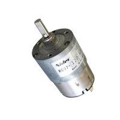
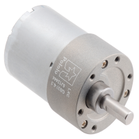

## Module's Selected Major Components

### Actuator: 12V/24V DC Gear Motor with Feedback
Requirement: 12V or 24V operation, integrated speed feedback, capable of driving robot over rough/rocky ground at 5-10 mph, surface-mount encoder interface preferred.

For more details, review the ["Appendix - Component Selection Process - Actuator"](https://embedded-systems-design.github.io/EGR314DataSheetTemplate/Appendix/01-Componet-Selection/Component-Selection-Process/#actuator) selection.

-----------

1. HG37-060-AB-00

    

    * $28.83/each
    * [link to product](https://www.digikey.com/short/p8jjb8t3)

    | Pros                                      | Cons                                                             |
    | ----------------------------------------- | ---------------------------------------------------------------- |
    | Lower cost – $28.83                       | 24V nominal - boost converter from 12V system                    |
    | durable, efficient |  might risk for project timeline                             |
    | 70 RPM @ 24V – good torque                          | 12-week lead time |
    | Industrial grade	                                    | Too slow for 5-10 mph |
    | 37mm diameter |

3. Pololu 24V 37D

    

    * $44.95/each
    * [link to product](https://www.pololu.com/product/4747)

    | Pros                                      | Cons                                                             |
    | ----------------------------------------- | ---------------------------------------------------------------- |
    | Same robust construction as 12V variant   | 24V nominal - convert to 12V |
    | 64 CPR encoder                            | Higher cost than Nidec                                           |
    | Lower current draw than 12V version at same power | 24V adds power supply complexity  |
    | Helical gearbox; quiet operation | Requires level shifting for 3.3V logic |

**Rationale:** A clock oscillator is easier ...
