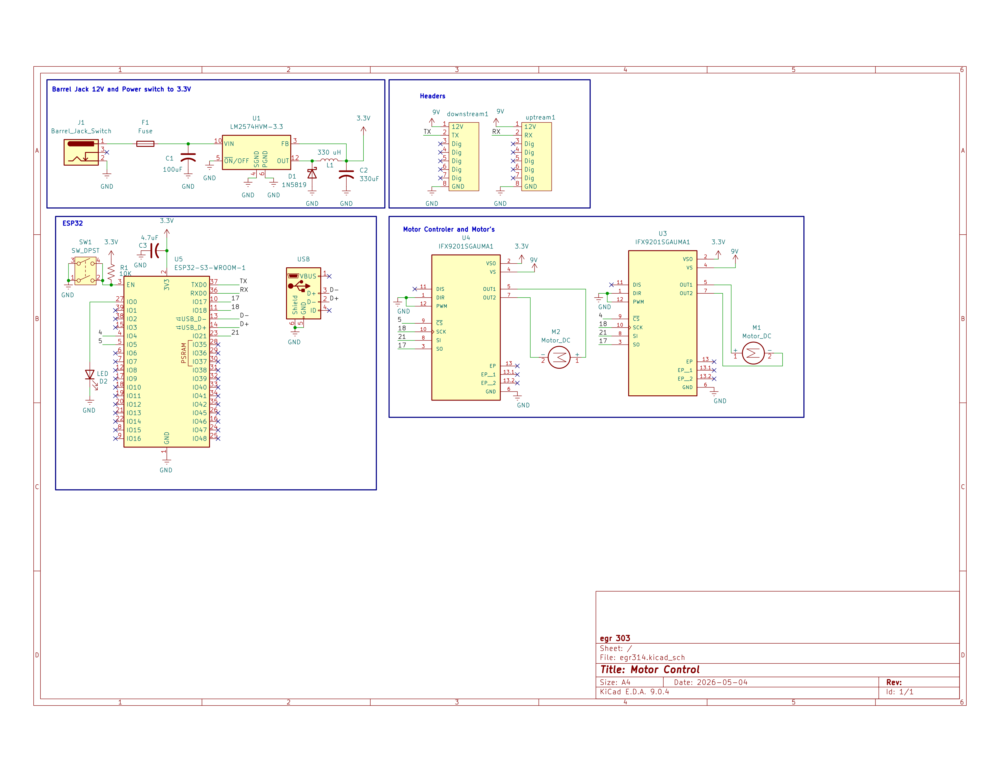

## Overview
The locomotion control module distributes 12 V power to the motor driver and converts it to 3.3 V to run the ESP32 and Hall effect sensor. The ESP32 reads wheel speed feedback from the sensor and uses this data to control the left and right gear motors through the IFX9201SG motor driver. This closed-loop approach allows the car/RC to move smoothly, maintain stability, and help regulate speed even on rough terrain. Power and communication signals are shared between modules through onboard headers, enabling coordinated movement and accurate distance control across the system.

**Figure 1:*

## Resouces

The schematic as a PDF download is available [*here*](sch.pdf), and the Zip folder of the project [*here*](sch.zip).
