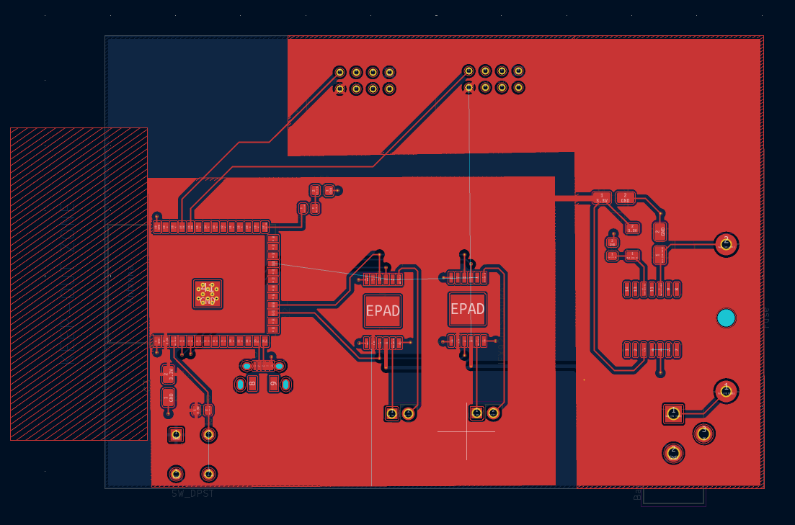
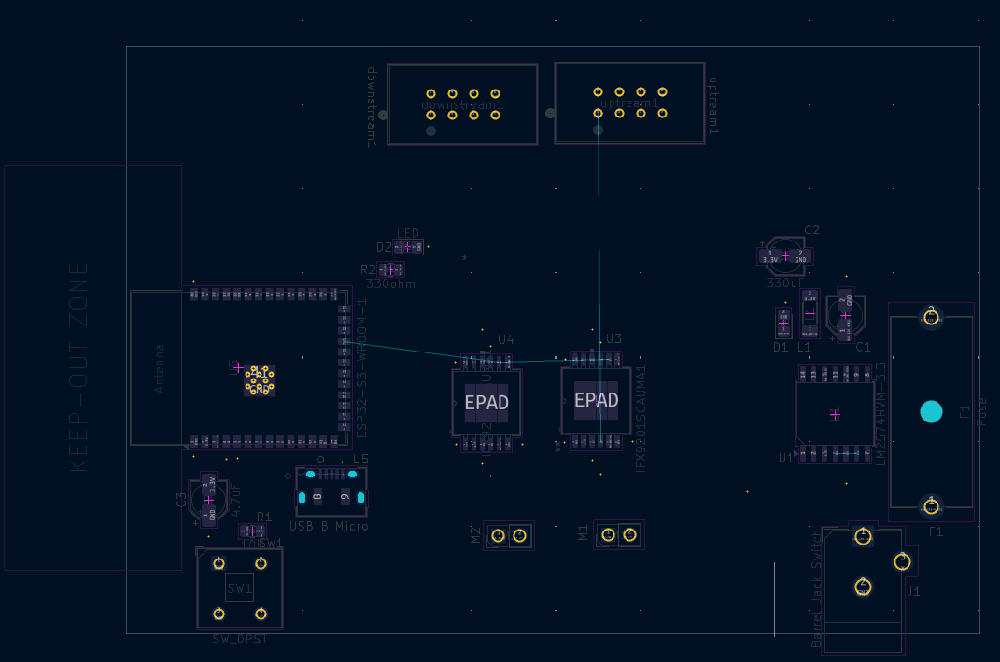
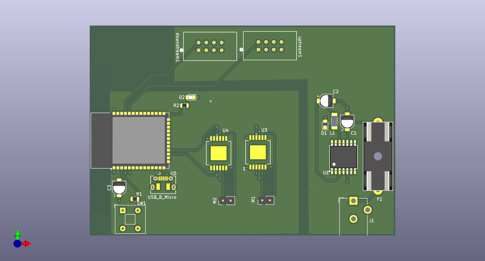
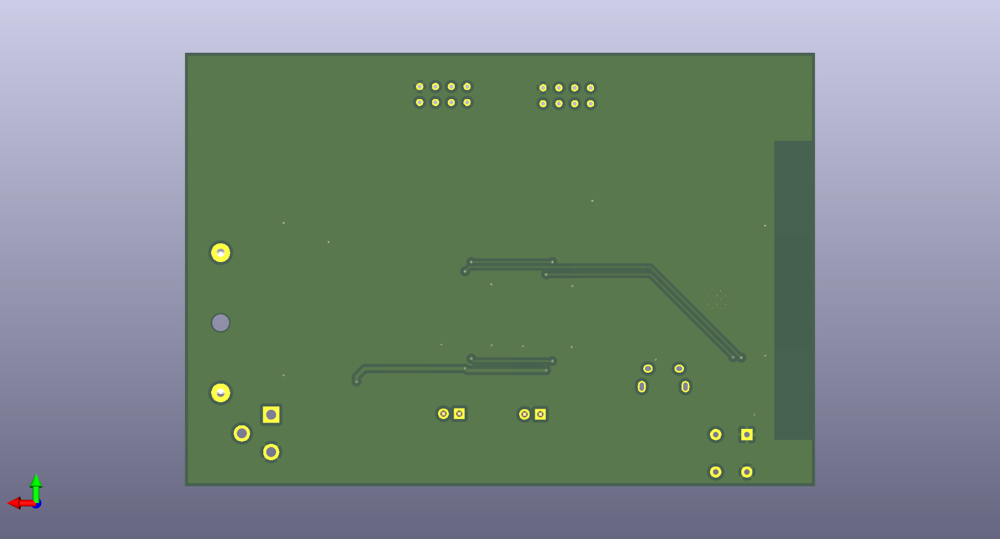
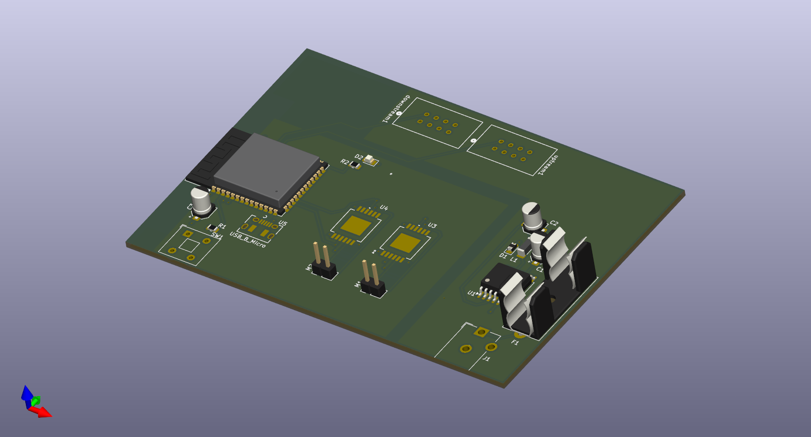

## Overview PCB
The locomotion control PCB is designed to efficiently distribute power and house the core control components for for our project search and rescue robot: SABLE. The board features two distinct power zones to ensure clean and stable operation of all subsystems.

## Power Distribution
- 12V Zone: A dedicated copper pour area supplies 12V directly to the IFX9201SG motor driver, which drives the left and right gear motors. This high-voltage zone handles the primary actuation power for locomotion.

- 3.3V Zone: A separate copper pour area provides 3.3V to the ESP32 microcontroller and all motor control logic. This low-voltage zone ensures sensitive components receive clean, regulated power for reliable operation.

**Figure 1:*

**Figure 2:*

## 3D

**Figure 3:*

**Figure 4:*

**Figure 5:*
